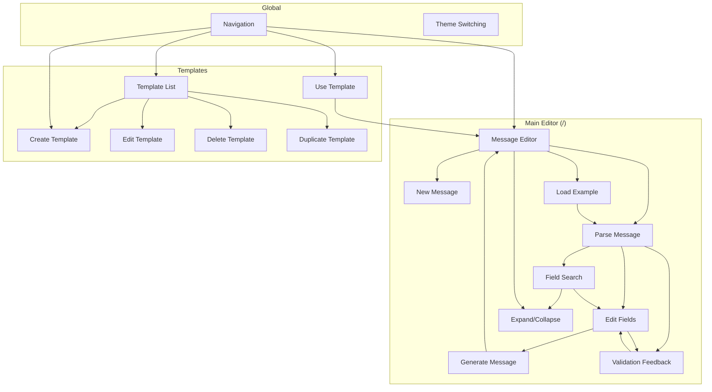

# User Flows Documentation

This directory contains comprehensive documentation of all user flows in the HL7 Helper Web application.

## Flow Inventory

| Flow | Status | Location |
|------|--------|----------|
| Parse HL7 Message | Documented | `main-editor/parse-message.md` |
| Edit Field | Documented | `main-editor/edit-field.md` |
| Generate HL7 Message | Documented | `main-editor/generate-message.md` |
| Expand/Collapse Segments | Documented | `main-editor/expand-collapse.md` |
| Load Example Message | Documented | `main-editor/load-example.md` |
| New Message | Documented | `main-editor/new-message.md` |
| Field Search | Documented | `main-editor/field-search.md` |
| Validation Feedback | Documented | `main-editor/validation-feedback.md` |
| View Templates | Documented | `templates/view-templates.md` |
| Create Template | Documented | `templates/create-template.md` |
| Edit Template | Documented | `templates/edit-template.md` |
| Delete Template | Documented | `templates/delete-template.md` |
| Duplicate Template | Documented | `templates/duplicate-template.md` |
| Use Template (Serialize) | Documented | `templates/use-template.md` |
| Navigation | Documented | `global/navigation.md` |
| Theme Switching | Documented | `global/theme-switching.md` |

## Entry Points

| Entry Point | URL | Description |
|-------------|-----|-------------|
| Main Editor | `/` | Primary message editing interface |
| Template List | `/templates` | View and manage templates |
| Create Template | `/templates/create` | Create new template |
| Use Template | `/templates/use` | Generate message from template |

## Flow Map

## Component Reference

| Component | File | Role |
|-----------|------|------|
| MessageEditor | `src/components/MessageEditor.tsx` | Displays parsed segments, handles expand/collapse |
| SegmentRow | `src/components/SegmentRow.tsx` | Individual segment display with fields |
| FieldInput | `src/components/FieldInput.tsx` | Field editing with component/subcomponent support |
| NavigationHeader | `src/components/NavigationHeader.tsx` | Navigation, action buttons, and search bar |
| SearchBar | `src/components/SearchBar.tsx` | Field search input with dropdown results |
| ValidationBadge | `src/components/ValidationBadge.tsx` | Validation status and issue display |
| ThemeSwitcher | `src/components/ThemeSwitcher.tsx` | Theme selection dropdown |

## Data Test IDs

| Element | data-testid | Location |
|---------|-------------|----------|
| Raw HL7 Input | `raw-hl7-input` | Main Editor textarea |
| Field Input | `field-input-{position}` | Individual field inputs |
| Field Input (Repetition) | `field-input-{position}-rep-{index}` | Repetition fields |
| Field Input (Composite) | `field-input-{position}-composite` | Composite field display |
| Field Expand Button | `field-expand-{position}` | Component expand button |
| Search Input | `search-input` | Field search input in header |
| Search Clear Button | `search-clear` | Clear search query button |
| Search Result Item | `search-result-{index}` | Individual search result |
| Validation Badge (Valid) | `validation-badge-valid` | Green valid badge |
| Validation Badge | `validation-badge` | Badge with issues |
| Validation Details Panel | `validation-details` | Expanded validation panel |
| Validation Issue Item | `validation-item-{code}` | Individual validation issue |
| Template Select | `template-select` | Use Template page dropdown |
| Raw HL7 Output | `raw-hl7-output` | Use Template output display |
| Edit Content Textarea | `edit-content-textarea` | Template edit raw content |
| View Mode All | `view-mode-all` | All Fields toggle button |
| View Mode Variables | `view-mode-variables` | Variables Only toggle button |
| Cancel Button | `cancel-button` | Use Template cancel |
| Serialize Button | `serialize-button` | Use Template serialize action |

## Keyboard Shortcuts Reference

| Shortcut | Action | Scope |
|----------|--------|-------|
| Ctrl+K / Cmd+K | Open field search | Global (works everywhere) |
| Alt+V | Toggle validation panel | Global (works everywhere) |
| Ctrl+Z / Cmd+Z | Undo | Visual editor only |
| Ctrl+Y / Cmd+Shift+Z | Redo | Visual editor only |
| Arrow Up/Down | Navigate search results | Search dropdown |
| Enter | Select search result | Search dropdown |
| Escape | Clear search / Close panel | Context-dependent |

## PWA Support (Phase 3)

The application now supports Progressive Web App (PWA) installation:

| Feature | Status | Details |
|---------|--------|---------|
| Manifest | ✅ Implemented | `/manifest.json` with app metadata |
| Icons | ✅ Implemented | SVG icons (any size, 192x192, 512x512) |
| Installable | ✅ Yes | Can be installed as standalone app |
| Offline | ❌ Not yet | Service worker not implemented |

## Last Updated

- **Date**: 2025-12-17
- **By**: UX-Specialist Agent
- **Changes**: Phase 3 update - Added clickable validation errors, search discoverability (Ctrl+K hint), keyboard shortcuts reference, and PWA support
